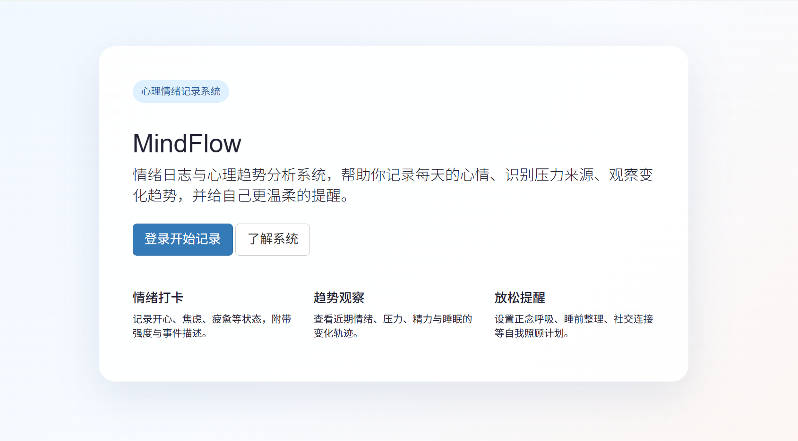

# MindFlow 心理情绪记录系统

MindFlow 是一个基于 Django 的心理情绪记录与趋势分析系统，适合课程实验项目改造与展示。

## 核心功能

1. 情绪打卡：记录开心、焦虑、疲惫、难过等情绪及强度。
2. 压力来源记录：补充事件背景、压力原因与缓解方式。
3. 心理趋势分析：查看情绪评分、压力等级、精力水平、睡眠时长的变化趋势。
4. 放松提醒：制定正念呼吸、睡前整理、社交连接等放松计划。
5. 心理建议：基于近期评估给出简要状态判断、鼓励语录与提醒建议。

## 快速部署

1. 安装 `Python 3.11`。
2. 安装依赖：

```bash
pip install -r requirements.txt
```

3. 进入 `src` 目录后执行迁移：

```bash
python manage.py makemigrations
python manage.py migrate
```

4. 启动服务：

```bash
python manage.py runserver 8000
```

5. 浏览器访问 `http://127.0.0.1:8000/`。
